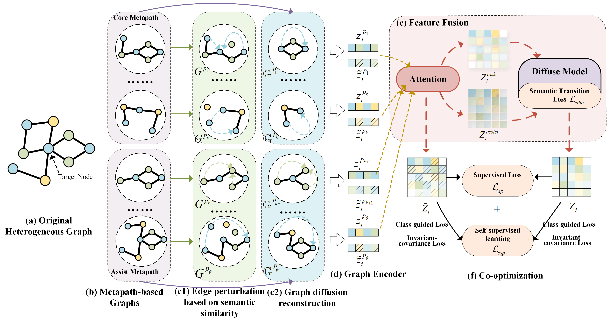
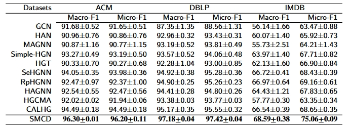
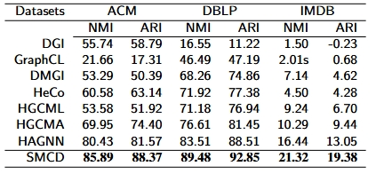

# SMCD: 



## 📝 Environment

We develop our code in the following environment and install all dependencies listed in *requirements.txt*:

- CUDA==12.1

- python==3.9.21

- torch==2.3.1

  

## 📚 Datasets


| Datasets |     Node      | Relation  | Metapath(core) | Metapath(assist) |
| :------: | :-----------: | :-------: | :------------: | :--------------: |
|   ACM    |  Paper:3025   | P-A:9936  |      PAP       |       APA        |
|          |  Author:5912  | P-S:3025  |      PSP       |       SPS        |
|          |  Subject:57   |           |                |      PSPAP       |
|   DBLP   |  Paper:14328  | P-A:19645 |      APA       |       CPC        |
|          |  Author:4057  | P-C:14328 |     APCPA      |       PAP        |
|          | Conference:20 |           |                |       PCP        |
|   IMDB   |  Movie:4664   | M-A:13983 |      MAM       |       AMA        |
|          |  Actor:5841   | M-D:4661  |      MDM       |       DMD        |
|          |  Direct:2270  |           |                |      MAMDM       |

## 🚀 How to run the codes

First, go into ./src, and then you can use the following command to run our model: 

> ```python
> python main.py dataset --gpu=0
> ```

Here, "dataset" can be "acm", "dblp", or "imdb".

## 👉 Code Structure

```
.
├── data
│   ├── acm
│   ├── dblp
│   └── imdb
├── src                    
│   ├── module    
│   ├── utils 
│   └── main.py
├── framework.png
├── performance1.png
├── performance2.png
└── README
```

## 🎯 Experimental Results

Performance comparison of baselines on different datasets in terms of Macro-F1 and Micro-F1:



Performance comparison of baselines on different datasets in terms of NMI and ARI:



## Acknowledgements

We are particularly grateful to the authors of [HGCMA](https://ieeexplore.ieee.org/abstract/document/10296092) and [CALHG](https://ojs.aaai.org/index.php/AAAI/article/view/33801), as parts of our code implementation were derived from their work. We have cited the relevant references in our paper.


